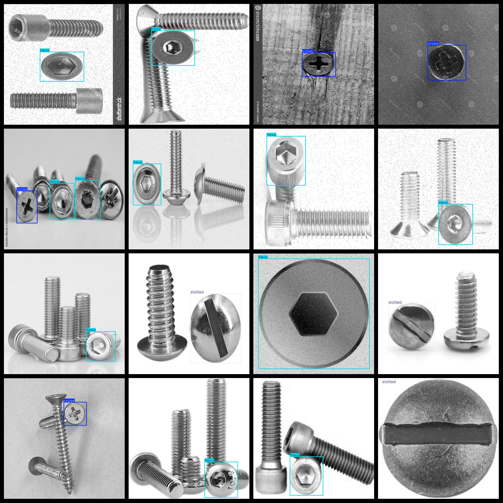

# Screw Head Type Detection Dataset 1144 imagesVOC+YOLO format

Screw head type detection dataset 1144 sheets VOC + YOLO format

Dataset format: Pascal VOC format + YOLO format (the txt file does not contain the split path, it only contains jpg images and corresponding VOC format xml files and yolo format txt files)

Number of images: 1144

Number of XML files: 1144

Number of annotations (number of txt files): 1144

Number of annotated categories: 3

The Github repository is: datasets_sl

["cross", "hexa", "slotted"]

Cross, Hexagon, Slot

Number of boxes labeled in each category:

Cross Frame Count = 444

Hexa Frame Size = 481

slotted frame count = 426

Total frames: 1351

Number of images per category:

Cross-occupied image count = 380

Hexa occupies 443 images.

Slotted occupancy of 352 images = 352

Image resolution: 640x640

Use the labeling tool: labelImg

Dataset Augmentation: No

Rules for annotation: Draw a rectangle around the category.

Important note: The dataset does not have been divided into training, validation, and testing sets.

Special Disclaimer: This dataset does not guarantee the accuracy of the trained models or weight files.

Annotation and image details are as follows:

## Images

---

Here is a pay link on Stripe (https://buy.stripe.com/3cs8yP7sY87d0vu9AB). Please contact me lonlonago@foxmail.com after funding $89, and I will send you a complete data files, thank you!

